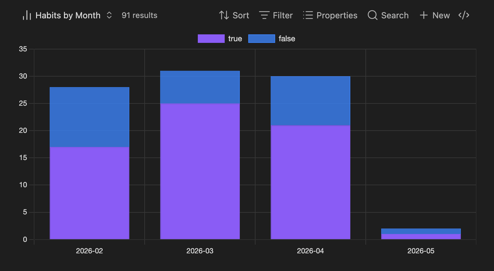
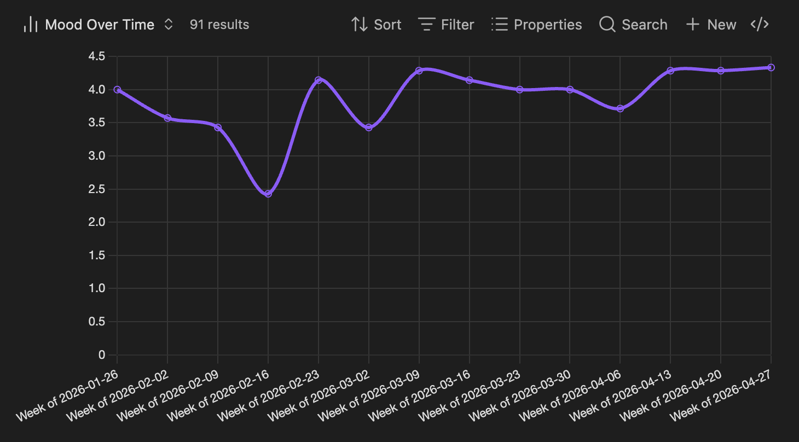
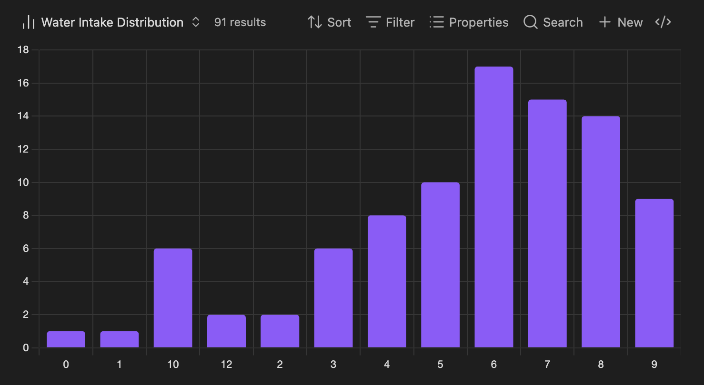
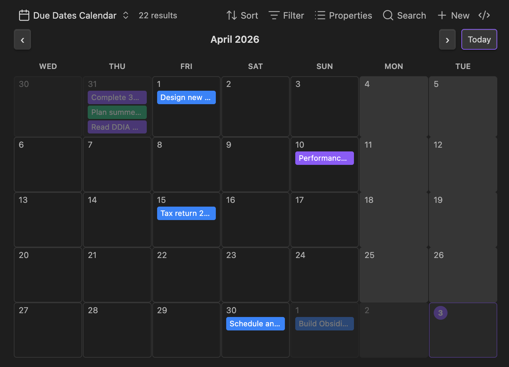
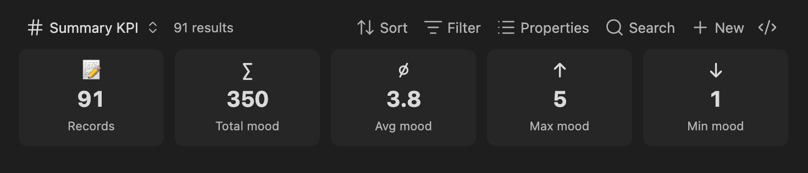

# Obsidian Dashboards

Advanced chart, calendar, heatmap, and habit-tracking views for [Obsidian Bases](https://obsidian.md/bases).  
Each view type is a standalone widget that can be embedded anywhere in your vault.

> **Requires** Obsidian ≥ 1.10.0 with the **Bases** core plugin enabled.

---

## Installation

1. Copy the plugin folder into `.obsidian/plugins/obsidian-dashboards/`.
2. In Obsidian → **Settings → Community plugins**, enable **Dashboards**.
3. Make sure **Settings → Core plugins → Bases** is also enabled.

---

## Quick start

Open (or create) any `.base` file and click the **view selector** in the toolbar to add a Dashboards view. Configure it with the options panel, or write the YAML directly.

To embed a view in a note:

```md
![[MyData.base#My View Name]]
```

---

## View types

### Chart — `odash-chart`

A fully configurable chart powered by Chart.js. Supports **line**, **area**, **bar**, **stacked-bar**, **pie**, **donut**, and **scatter**.






```yaml
- type: odash-chart
  name: Mood Over Time
  chartType: line        # line | area | bar | stacked-bar | pie | donut | scatter
  xField: note.date
  yField: note.mood
  aggregation: avg       # count | sum | avg | min | max
  dateBucket: week       # day | week | month | quarter | year | none
  showLegend: false
  cumulative: false
```

| Option | Type | Default | Description |
|---|---|---|---|
| `chartType` | dropdown | `bar` | Chart style |
| `xField` | property | — | Horizontal axis / category |
| `yField` | property | — | Value to aggregate (optional for count) |
| `seriesField` | property | — | Split into multiple series |
| `aggregation` | dropdown | `count` | How to reduce values per bucket |
| `dateBucket` | dropdown | `none` | Group dates by this period |
| `showLegend` | toggle | `true` | Show the series legend |
| `cumulative` | toggle | `false` | Accumulate values over time |
| `showLabels` | toggle | `false` | Show value labels on bars |
| `nullHandling` | dropdown | `skip` | `skip`, `zero`, or `interpolate` |

---

### Calendar — `odash-calendar`

A month, week, or agenda calendar. Records with a date field appear as events. Works great as a **due-date tracker** for projects and tasks.

> 📸 **Screenshot** — open the **Due Date Calendar** view in your Projects base. Capture the month grid with several project deadlines visible as coloured event chips.

```yaml
- type: odash-calendar
  name: Due Date Calendar
  primaryDateField: note.due_date    # when the item is due
  endDateField: note.end_date        # optional — for multi-day deliverables
  titleField: note.project           # text shown on each event chip
  colorField: note.priority_color    # optional hex color per event (e.g. "#ef4444")
  calendarMode: month                # month | week | agenda
  showWeekends: true
  firstDayOfWeek: "1"                # "1" = Monday, "0" = Sunday
```

| Option | Type | Default | Description |
|---|---|---|---|
| `primaryDateField` | property | — | Start date for each event |
| `endDateField` | property | — | End date (optional, for multi-day events) |
| `titleField` | property | — | Text shown on each event chip |
| `colorField` | property | — | Hex color per event |
| `calendarMode` | dropdown | `month` | View mode |
| `showWeekends` | toggle | `true` | Include Sat/Sun columns |
| `firstDayOfWeek` | dropdown | `"1"` | Week start day |

---

### Heatmap — `odash-heatmap`

A GitHub-style contribution grid. Works as a pure activity tracker (darker = more records) or maps a numeric field to colour intensity.




```yaml
- type: odash-heatmap
  name: Sleep Heatmap
  dateField: note.date
  valueField: note.sleep_hrs   # omit for activity count
  aggregation: avg             # count | sum | avg
  monthsBack: 3
  colorScheme: blue            # green | blue | purple | orange | red
  showStats: true
  firstDayOfWeek: "1"
  minValue: 0                  # optional fixed scale min
  maxValue: 10                 # optional fixed scale max
```

| Option | Type | Default | Description |
|---|---|---|---|
| `dateField` | property | — | Required. Date of each record |
| `valueField` | property | — | Numeric field to map to colour; omit to count records |
| `aggregation` | dropdown | `count` | How to combine multiple records per day |
| `monthsBack` | slider 1–12 | `6` | How many months to display |
| `colorScheme` | dropdown | `green` | Colour palette |
| `showStats` | toggle | `true` | Show active-days / total / avg KPI bar |
| `firstDayOfWeek` | dropdown | `"1"` | Week start day |
| `minValue` | text | auto (0) | Pin the bottom of the colour scale |
| `maxValue` | text | auto | Pin the top of the colour scale |

---

### KPI cards — `odash-kpi`

A row of summary tiles: total records, and (if a metric field is set) sum, average, max, and min.


```yaml
- type: odash-kpi
  name: Summary KPI
  metricField: note.mood   # optional — omit for record count only
```

| Option | Type | Default | Description |
|---|---|---|---|
| `metricField` | property | — | Numeric field to summarise |

---

### Ranking — `odash-ranking`

Horizontal bar chart showing the top-N values for a categorical field. Works great as a **project breakdown by category, status, or owner**.




```yaml
- type: odash-ranking
  name: Projects by Category
  groupField: note.category    # required — field to group by
  metricField: note.effort     # optional — aggregate this instead of counting
  aggregation: count           # count | sum | avg
  topN: 5
```

| Option | Type | Default | Description |
|---|---|---|---|
| `groupField` | property | — | Required. Categorical field to group by |
| `metricField` | property | — | Numeric field to aggregate; omit to count |
| `aggregation` | dropdown | `count` | Aggregation method (hidden when no metric) |
| `topN` | slider 3–20 | `5` | Maximum rows to show |

---

### Sparkline — `odash-sparkline`

A compact trend line showing how a metric changes over time.

> 📸 **Screenshot** — open `Bases/Habits.base`, switch to the **Mood Trend** view. Capture the line chart showing weekly average mood over the full period.

```yaml
- type: odash-sparkline
  name: Mood Trend
  dateField: note.date
  metricField: note.mood   # optional — omit to count records per period
  aggregation: avg         # count | sum | avg
  dateBucket: week         # week | month | quarter
```

| Option | Type | Default | Description |
|---|---|---|---|
| `dateField` | property | — | Required. Date axis |
| `metricField` | property | — | Numeric field to plot; omit to count |
| `aggregation` | dropdown | `count` | Aggregation per bucket |
| `dateBucket` | dropdown | `month` | Grouping period |

---

### Recent records — `odash-recent`

A list of the most recent notes, sorted by date and clickable to open.

> 📸 **Screenshot** — open `Bases/Habits.base`, switch to the **Recent Entries** view. Capture the list showing the 10 most recent daily notes with their dates.

```yaml
- type: odash-recent
  name: Recent Entries
  dateField: note.date   # used for sorting
  topN: 10
```

| Option | Type | Default | Description |
|---|---|---|---|
| `dateField` | property | — | Sort field; auto-detected if omitted |
| `topN` | slider 3–25 | `10` | Number of records to show |

---

### Streak — `odash-streak`

KPI tiles for a habit: current streak, longest streak, overall completion rate, 7-day rolling average, and 30-day rolling average.

> 📸 **Screenshot** — open `Bases/Habits.base`, switch to the **Exercise Streak** view. Capture the five KPI tiles.

```yaml
- type: odash-streak
  name: Exercise Streak
  dateField: note.date
  habitField: note.exercise
  successRule: any           # any | gt-zero | gte-target
  targetValue: 1             # used only when successRule = gte-target
```

| Option | Type | Default | Description |
|---|---|---|---|
| `dateField` | property | — | Date of each daily note |
| `habitField` | property | — | Field that records the habit (checkbox or number) |
| `successRule` | dropdown | `any` | When to count a day as completed |
| `targetValue` | slider 1–100 | `1` | Target for `gte-target` rule |

---

### Week bars — `odash-week-bars`

A compact mini bar chart showing weekly completion rate over recent weeks. Green ≥ 80 %, amber ≥ 50 %, red below.

> 📸 **Screenshot** — open `Bases/Habits.base`, switch to the **Exercise Weekly** view. Capture the bar chart spanning 12 weeks, ideally with a mix of green, amber, and red bars visible.

```yaml
- type: odash-week-bars
  name: Exercise Weekly
  dateField: note.date
  habitField: note.exercise
  successRule: any
  targetValue: 1
  weeksBack: 12
```

| Option | Type | Default | Description |
|---|---|---|---|
| `dateField` | property | — | Date field |
| `habitField` | property | — | Habit field |
| `successRule` | dropdown | `any` | Completion criterion |
| `targetValue` | slider 1–100 | `1` | Target for `gte-target` |
| `weeksBack` | slider 4–52 | `12` | How many weeks to display |

---

## Stacking widgets in a note

Because every view type is independent, you can compose a dashboard by embedding multiple views in a single note:

```md
## Exercise

![[Bases/Habits.base#Exercise Streak]]
![[Bases/Habits.base#Exercise Heatmap]]
![[Bases/Habits.base#Exercise Weekly]]
```

> 📸 **Screenshot** — open `Dashboards/Habits.md` and scroll to the **Exercise Tracker** section. Capture all three embedded widgets together to show how stacking looks in Reading view.

---

## Hiding the toolbar

Every embedded Base view shows a toolbar by default. To suppress it — keeping only the **Edit** button — add this CSS snippet to your vault (Settings → Appearance → CSS snippets):

```css
/* Works with:
   1) note frontmatter: cssclasses: [bases-no-toolbar]
   2) embed alias: ![[MyBase.base|no-toolbar]]
   Keeps the Edit button visible
*/

:is(
  .bases-no-toolbar,
  .bases-embed[alt~="no-toolbar"]
)
.bases-toolbar-item:not(:has([aria-label="Edit the base"])),
:is(
  .bases-no-toolbar,
  .bases-embed[alt~="no-toolbar"]
)
.query-toolbar {
  display: none;
}
```

**Option 1 — hide toolbar on the whole note** (add to front matter):

```yaml
---
cssclasses:
  - bases-no-toolbar
---
```

**Option 2 — hide toolbar on a single embed** (add `|no-toolbar` alias):

```md
![[Bases/Habits.base#Activity Heatmap|no-toolbar]]
```

> 📸 **Screenshot** — open `Dashboards/Habits.md` with the snippet active. Capture one embedded view with the toolbar hidden next to one without, so the difference is clear.

---

## Habit modelling

The **Streak** and **Week bars** widgets support two modelling approaches:

| Model | Setup | `successRule` |
|---|---|---|
| **Daily note** | One note per day; the habit is a checkbox (`true`/`false`) or number property | `any`, `gt-zero`, or `gte-target` |
| **Event log** | One note per completion event with a date property | `any` (each record counts as one completion) |

---

## All view type IDs

| View | Type ID |
|---|---|
| Chart | `odash-chart` |
| Calendar | `odash-calendar` |
| Heatmap | `odash-heatmap` |
| KPI cards | `odash-kpi` |
| Ranking | `odash-ranking` |
| Sparkline | `odash-sparkline` |
| Recent records | `odash-recent` |
| Streak | `odash-streak` |
| Week bars | `odash-week-bars` |
